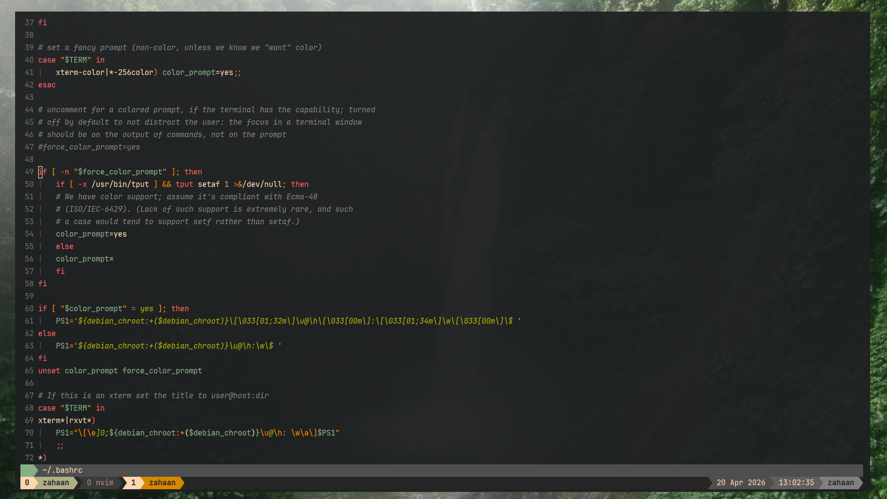
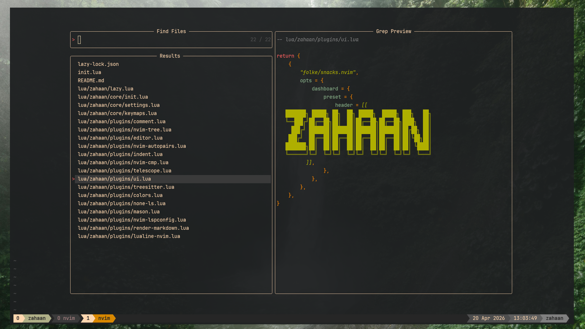

# dotfiles

A collection of terminal and editor configs centered around a **Gruvbox** theme and **Vim-style** keyboard workflow.

---

## Contents

| Tool | Description | Config |
|------|-------------|--------|
| [WezTerm](wezterm/README.md) | GPU-accelerated terminal emulator | `wezterm/wezterm.lua` |
| [Neovim](nvim/README.md) | Modal text editor with LSP, completion, and fuzzy finding | `nvim/` |
| [tmux](tmux/README.md) | Terminal multiplexer with Gruvbox status line | `tmux/tmux.conf` |
| [KMonad](kmonad/README.md) | System-level keyboard remapper — Vim navigation on any keyboard | `kmonad/kmonad-template.kbd` |
| [Starship](starship/README.md) | Cross-shell prompt with Gruvbox powerline segments | `starship/starship.toml` |
| [Bash Files](bashfiles/README.md) | Modular alias library — 20 topic files loaded at shell startup | `~/.aliases.d/` |

---

## Quick Overview

### [WezTerm](wezterm/README.md)
A minimal WezTerm setup with Gruvbox dark hard colorscheme, JetBrainsMono Nerd Font, slight window transparency, and a bottom tab bar that hides when only one tab is open.

### [Neovim](nvim/README.md)
A full-featured Neovim config built on **lazy.nvim** with LSP (TypeScript, Angular, CSS, HTML, Lua), Treesitter syntax highlighting, Telescope fuzzy finding, nvim-tree file explorer, and auto-formatting via prettierd and stylua. Leader key is `Space`.

### [tmux](tmux/README.md)
A minimal tmux config tuned for WezTerm with true-color and undercurl passthrough, Vim-style pane navigation (`prefix + h/j/k/l`), and a Gruvbox status line showing session, username, windows, date/time, and hostname.

### [KMonad](kmonad/README.md)
Remaps `Caps Lock` and `Left Ctrl` into a dual-purpose key: tap for `Ctrl`, hold to activate a navigation layer where `H/J/K/L` become arrow keys and `[` becomes `Esc` — no hand movement required.

### [Starship](starship/README.md)
A Gruvbox-themed powerline prompt built on Starship, showing OS icon, username, directory (with icon substitutions), git branch and status, active language runtimes (Node, Python, Rust, Go, and more), Docker/Conda context, and a live `HH:MM` clock — all in a single segmented strip.

### [Bash Files](bashfiles/README.md)
Twenty numbered alias modules (`01-navigation.sh` through `20-backup.sh`) covering navigation, listing, file ops, git, Docker, tmux, Python, Node, editors, and productivity. A thin loader (`~/.alias.sh`) sources them all at startup. The `backupbash` command snapshots the live configs into timestamped directories under `~/.config/bashfiles/`.

---

## Common Dependencies

| Dependency | Used by |
|---|---|
| **Nerd Font** (JetBrainsMono recommended) | WezTerm, Neovim, tmux, Starship |
| **Node.js 18+** | Neovim LSP servers |
| **ripgrep** (`rg`) | Neovim Telescope live grep |
| **fd** | Neovim Telescope file search |
| **uinput** kernel module | KMonad |
| **Starship** binary | Shell prompt |

---

## Setup

Clone this repo (or ensure it lives at `~/.config/`) and install each tool. Each subdirectory has its own README with detailed installation steps, configuration notes, and keybinding references.
